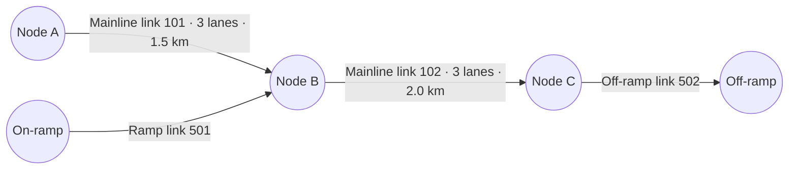
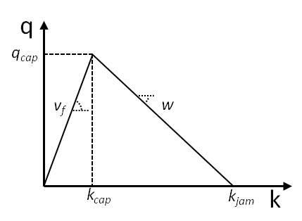

# 2026 IEEE Big Data Traffic Flow Bench: Technical and Competition Guide

TrafficFlowBench is a synthetic benchmark for reconstructing traffic states, forecasting queues, checking traffic physics, and estimating origin-destination (OD) path flows. This guide introduces the traffic quantities, describes the data package, and explains what each task uses and asks participants to submit. The pinned [official competition repository](../official_competition_repo/README.md) contains the authoritative task rules and scorer implementations. The data package is distributed separately on the [Kaggle Data page](https://www.kaggle.com/competitions/2026-ieee-big-data-traffic-flow-bench/data).

## 1. Competition overview

The competition has four scored tasks. Tasks 1, 2, and 4 require predictions. Task 3 evaluates the physical consistency of Task 1 predictions and has no separate upload.

| Task                            | What it measures                                                | Participant output                                     |
| ------------------------------- | --------------------------------------------------------------- | ------------------------------------------------------ |
| 1. Traffic-state reconstruction | Accuracy of masked speed and flow predictions                   | Speed and total flow for each target station-time cell |
| 2. Queue forecasting            | Accuracy of future queue predictions                            | Binary queue status for each future link-time cell     |
| 3. Physical consistency         | Agreement with the fundamental diagram and vehicle conservation | No separate file, scored from Task 1                   |
| 4. OD and path-flow estimation  | Accuracy and consistency of estimated path flows                | A non-negative flow for each candidate path            |

The total score is

$$
S_{\text{total}}=
0.35S_{\text{state}}+
0.30S_{\text{queue}}+
0.15S_{\text{physics}}+
0.20S_{\text{ODME}}.
$$

For each task, first average the scores for the included directions within each freeway family. Then average the family scores equally. A missing task score contributes zero to the total. If a panel has no scoring targets, its score for that task is zero.

For the official suggested task order and an explanation of how the tasks connect, see [“How the tasks connect”](../official_competition_repo/README.md#how-the-tasks-connect) in the repository README.

## 2. Traffic foundations

### 2.1 Freeway networks as directed graphs

A directional freeway panel is represented as a directed graph:

$$
G=(V,E),
$$

where $V$ contains junctions and $E$ contains directed road links between junctions. Mainline links carry traffic along the freeway. On-ramp links join the mainline, and off-ramp links leave it. A detector station is attached to a link and reports measurements for that location. The station is not itself a graph node or link, and more than one station may measure the same link.



This schematic illustrates how ramps connect to the mainline. It is an example rather than a corridor map.

### 2.2 Traffic state variables

The following table defines the key traffic state variables used in the analysis.

| Quantity         | Symbol | Unit               | Physical meaning                                           |
| ---------------- | ------ | ------------------ | ---------------------------------------------------------- |
| Speed            | $v$    | km/hour            | Measured traffic speed on the link                         |
| Total flow       | $F$    | vehicles/hour      | Hourly flow across all lanes of the link                   |
| Lane count       | $n$    | lanes              | Number of lanes on the link                                |
| Per-lane flow    | $q$    | vehicles/hour/lane | Hourly throughput through one lane                         |
| Per-lane density | $k$    | vehicles/km/lane   | Vehicles occupying one kilometre of one lane               |
| Total density    | $K$    | vehicles/km        | Density summed across the link's lanes                     |
| Link length      | $L$    | km                 | Length of the link                                         |
| Accumulation     | $N$    | vehicles           | Vehicle count on the link, derived from density and length |

Speed, flow, and density are linked by the fundamental identity:

$$
q=kv\quad\Longleftrightarrow\quad k=\frac{q}{v}\quad\Longleftrightarrow\quad v=\frac{q}{k}.
$$

The flow values in the data are totals across all lanes. Divide by the lane count to get per-lane flow and calculate density from the observed flow and speed:

$$
q=\frac{F}{n},
\qquad
k=\frac{q}{v}=\frac{F}{nv}.
$$

Summing density across lanes gives $K=nk=F/v$. Multiplying by link length gives accumulation:

$$
N=KL=\frac{F}{v}L.
$$

**Example.** A three-lane, two-kilometre link has total flow 3,600 vehicles/hour and speed 80 km/hour. Its per-lane flow is 1,200 vehicles/hour/lane, its per-lane density is 15 vehicles/km/lane, and its accumulation is 90 vehicles.

### 2.3 Triangular fundamental diagram

A fundamental diagram (FD) gives the feasible flow at each traffic density. On the free-flow branch, flow increases with density. It reaches capacity at critical density, then decreases on the congested branch until flow reaches zero at jam density.

| Parameter         | Meaning                                                | Unit               |
| ----------------- | ------------------------------------------------------ | ------------------ |
| $v_f$             | Free-flow speed and free-flow branch slope             | km/hour            |
| $k_{\text{crit}}$ | Critical density at capacity                           | vehicles/km/lane   |
| $k_{\text{jam}}$  | Jam density, where flow is zero                        | vehicles/km/lane   |
| $w$               | Magnitude of the upstream-moving congestion-wave speed | km/hour            |
| $C_{\text{lane}}$ | Capacity per lane                                      | vehicles/hour/lane |

The triangular FD is

$$
q(k)=
\begin{cases}
v_f k, & 0\le k\le k_{\text{crit}},\\
w(k_{\text{jam}}-k), & k_{\text{crit}}<k\le k_{\text{jam}}.
\end{cases}
$$

Flow reaches its maximum, the per-lane capacity $C_{\text{lane}}$, at the critical density $k_{\text{crit}}$: $C_{\text{lane}}=v_f k_{\text{crit}}$. The congested branch falls from that point to zero flow at jam density, so

$$
w=\frac{C_{\text{lane}}}{k_{\text{jam}}-k_{\text{crit}}}.
$$

The figure labels the critical-density point as $k_{\text{cap}}$. This is the same quantity called $k_{\text{crit}}$ in the equations. The data gives critical and jam density for each link as totals across its lanes. Divide each by the lane count to use this per-lane diagram.



### 2.4 Vehicle conservation

For link $e$, let $N_e(t)$ be its accumulation at time $t$. Let $F_{\text{in}}$ and $F_{\text{out}}$ be the total mainline inflow and outflow rates, and $F_{\text{on}}$ and $F_{\text{off}}$ the on-ramp inflow and off-ramp outflow rates. Over one interval, the change in accumulation equals the net rate multiplied by the interval duration:

$$
N_e(t+\Delta t)-N_e(t)=
\Delta t\left(
F_{\text{in}}(t)+F_{\text{on}}(t)-F_{\text{out}}(t)-F_{\text{off}}(t)
\right).
$$

All four rates are already totals across lanes, so use them as written in the equation. An unavailable ramp reading is missing evidence, not zero flow.

## 3. Released data package

Traffic records are synthetic and use a synthetic calendar. The package has two broad kinds of data: **static network data**, which describes each panel's roads and connections, and **dynamic data**, which records traffic across time.

### 3.1 Families, panels, and time splits

The package contains static network files and dynamic observations for ten directional panels across five freeway families. Each panel is identified by its family and direction.

| Freeway family | Panel IDs                  |
| -------------- | -------------------------- |
| D7 I-10        | `D7_I10_E`, `D7_I10_W`     |
| D7 I-210       | `D7_I210_E`, `D7_I210_W`   |
| D7 I-405       | `D7_I405_N`, `D7_I405_S`   |
| D12 I-5        | `D12_I5_N`, `D12_I5_S`     |
| D12 I-405      | `D12_I405_N`, `D12_I405_S` |

Dynamic observations were taken in five-minute intervals ($\Delta t = 1/12$ hour) and grouped into three date splits:

| Split        | Dates, inclusive         | Days |
| ------------ | ------------------------ | ---: |
| `train`      | 2030-06-01 to 2031-02-28 |  273 |
| `validation` | 2031-03-01 to 2031-03-31 |   31 |
| `private`    | 2031-04-01 to 2031-04-30 |   30 |

The validation and private date ranges were generated independently with different demand draws and incident schedules.

If you use local historical traffic data to calibrate a model, use it only to calculate aggregate statistics. The policy in `config/synthetic_release_v1.json` prohibits replaying rows, shifting timestamps, or sampling or copying historical speed, flow, occupancy, or quality-flag values.

### 3.2 Package layout

See [data download instructions](data.md) for how to download and unpack the official release data. The tree below shows one panel and the package-level submission files. Panel and split directories repeat this structure.

```text
<release-root>/
  config/
    competition_contract.json
    corridors.json
    synthetic_release_v1.json
  corridors/<PANEL>/
    network/
      fd_parameters.csv
      links.csv
      lwr_mainline_topology.csv
      path_link_incidence.csv
      path_set.csv
      ramp_attachment_map.csv
      synthetic_network_manifest.json
      synthetic_ramp_attachment_map.csv
    train/
      mainline_states/
        year_month=<YYYY>-<MM>/synthetic_mainline_<YYYY>_<MM>_<DD>.parquet
      mainline_states_masked/
        mask_regime=<REGIME>/synthetic_mainline_<YYYY>_<MM>_<DD>.parquet
      ramp_states/
        year_month=<YYYY>-<MM>/synthetic_ramp_<YYYY>_<MM>_<DD>.parquet
    validation/
      mainline_states_masked/
        mask_regime=<REGIME>/synthetic_mainline_<YYYY>_<MM>_<DD>.parquet
      ramp_states/
        year_month=<YYYY>-<MM>/synthetic_ramp_<YYYY>_<MM>_<DD>.parquet
    private/
      mainline_states_masked/
        mask_regime=<REGIME>/synthetic_mainline_<YYYY>_<MM>_<DD>.parquet
      ramp_states/
        year_month=<YYYY>-<MM>/synthetic_ramp_<YYYY>_<MM>_<DD>.parquet
  task1/<PANEL>/<SPLIT>/sample_submission_state.csv
  task2/<PANEL>/<SPLIT>/
    window_index.csv
    window_history.parquet
    sample_submission_queue.csv
  task4/<PANEL>/<SPLIT>/
    synthetic_link_counts.csv
    synthetic_weak_prior.csv
    sample_submission_path_flow.csv
  sample_submission.csv
  submission_key.csv
```

The release-level [`config/competition_contract.json`](../kaggle_public/config/competition_contract.json) defines the data-quality and scoring contract, [`config/corridors.json`](../kaggle_public/config/corridors.json) maps panels to freeway families, and [`config/synthetic_release_v1.json`](../kaggle_public/config/synthetic_release_v1.json) records the synthetic calendar and data-use policy. Each panel’s `network/synthetic_network_manifest.json` identifies its structural and synthetic network inputs.

## 4. Shared Static Network Data

Under `corridors/<PANEL>/network`, the package provides files describing the static network topology.

### Mainline link attributes: `corridors/<PANEL>/network/links.csv`

**Key:** `link_id` (within a panel)

| Field            | Type    | Meaning                              |
| ---------------- | ------- | ------------------------------------ |
| `link_id`        | string | Mainline link identifier             |
| `length_km`      | float   | Link length in kilometres            |
| `lanes`          | int | Number of lanes                      |
| `free_speed_kmh` | float   | Free-flow speed in km/hour           |
| `capacity_vph`   | float   | Total link capacity in vehicles/hour |

### Fundamental-diagram parameters: `corridors/<PANEL>/network/fd_parameters.csv`

**Key:** `link_id` (within a panel)

| Field              | Type    | Meaning                                                                                  |
| ------------------ | ------- | ---------------------------------------------------------------------------------------- |
| `link_id`          | string | Mainline link identifier                                                                 |
| `length_km`        | float   | Link length in kilometres                                                                |
| `lanes`            | int | Lane count for per-lane conversions                                                      |
| `free_speed_kmh`   | float   | Free-flow speed in km/hour                                                               |
| `capacity_vph`     | float   | Total link capacity in vehicles/hour                                                     |
| `critical_density` | float   | Total link density at capacity, in vehicles/km. Divide by `lanes` for the per-lane value |
| `k_jam`            | float   | Total link jam density, in vehicles/km. Divide by `lanes` for the per-lane value         |

### Mainline connectivity: `corridors/<PANEL>/network/lwr_mainline_topology.csv`

**Key:** `link_id` (same identifier as `mainline_link_id`, within a panel)

| Field                                          | Type                                            | Meaning                                                      |
| ---------------------------------------------- | ----------------------------------------------- | ------------------------------------------------------------ |
| `mainline_link_id`, `link_id`                  | string                                        | Both fields identify this row's mainline link                 |
| `incoming_link_ids`, `outgoing_link_ids`       | string (semicolon-separated IDs)                   | Links entering and leaving this link                         |
| `on_ramp_link_ids`, `off_ramp_link_ids`        | string (semicolon-separated IDs)                   | Ramps attached to this link                                  |
| `incoming_has_sensor`, `outgoing_has_sensor`   | string (semicolon-separated 0/1 boolean flags)     | Sensor presence for corresponding incoming or outgoing links |
| `lanes`                                        | int                            | Lane count                                                   |
| `length_km`                                    | float                                           | Link length in kilometres                                    |
| `capacity_vph`                                 | float                                           | Total link capacity in vehicles/hour                         |
| `free_speed_kmh`, `free_flow_speed_kmh`        | float                                           | Free-flow speed values recorded in the topology              |
| `order_index`                                  | int                                         | Position in the mainline order                               |
| `from_node`, `to_node`                         | string                                        | Directed link endpoints                                      |
| `has_sensor`                                   | bool (0/1 encoded)                                | Whether the link has a detector                              |
| `detector_id`                                  | string, may be empty                           | Associated detector station                                  |
| `n_incoming`, `n_outgoing`                     | int                                         | Incoming and outgoing link counts                            |
| `n_incoming_no_sensor`, `n_outgoing_no_sensor` | int                                         | Incoming and outgoing links without sensors                  |

### Ramp attachments: `corridors/<PANEL>/network/ramp_attachment_map.csv`

**Key:** `ramp_link_id` (within a panel)

| Field                      | Type                 | Meaning                                                 |
| -------------------------- | -------------------- | ------------------------------------------------------- |
| `ramp_link_id`             | string              | Ramp link identifier used in this panel's ramp observations |
| `ramp_type`                | string enum: `OR`, `FR` | Ramp direction: `OR` joins the mainline, and `FR` leaves it |
| `nearest_mainline_link_id` | string              | Mainline link to which the ramp is attached             |

### Synthetic ramp attachments: `corridors/<PANEL>/network/synthetic_ramp_attachment_map.csv`

**Key:** `ramp_link_id` (within a panel)

| Field                      | Type                 | Meaning                                                 |
| -------------------------- | -------------------- | ------------------------------------------------------- |
| `ramp_link_id`             | string              | Synthetic ramp link identifier used in ramp observations |
| `ramp_type`                | string enum: `OR`, `FR` | Ramp direction: `OR` joins the mainline, and `FR` leaves it |
| `nearest_mainline_link_id` | string              | Mainline link to which the synthetic ramp is attached   |

### Candidate paths: `corridors/<PANEL>/network/path_set.csv`

**Key:** `path_id` (within a panel)

| Field                             | Type                                  | Meaning                                          |
| --------------------------------- | ------------------------------------- | ------------------------------------------------ |
| `path_id`                         | string                               | Candidate path identifier                        |
| `origin_zone`, `destination_zone` | string                              | Origin and destination zones for the path        |
| `link_seq`                        | string (ordered, semicolon-separated link IDs) | Mainline links in the order the path traverses them |

### Path-link incidence: `corridors/<PANEL>/network/path_link_incidence.csv`

**Key:** (`path_id`, `link_id`)

| Field     | Type    | Meaning                                    |
| --------- | ------- | ------------------------------------------ |
| `link_id` | string | Mainline link traversed by the path        |
| `path_id` | string | Candidate path that traverses this link    |

## 5. Shared Dynamic Traffic Observations

Traffic observations are recorded in five-minute intervals.

Parquet `date` and `timestamp` fields are stored as ISO-formatted text. Timestamps use UTC.

### Mainline state records: `corridors/<PANEL>/<SPLIT>/mainline_states_masked/mask_regime=<REGIME>/synthetic_mainline_<YYYY>_<MM>_<DD>.parquet`

Each record describes one detector station measuring one link during an interval.

**Key within a panel:** (`timestamp`, `station_id`, `link_id`)

| Field                       | Type                         | Meaning                                                                                                                              |
| --------------------------- | ---------------------------- | ------------------------------------------------------------------------------------------------------------------------------------ |
| `corridor_id`               | string                      | Directional panel                                                                                                                    |
| `date`                      | string (YYYY-MM-DD)                         | Calendar date of the observation                                                                                                     |
| `timestamp`                 | string (UTC timestamp)                | Start of the five-minute interval                                                                                                    |
| `station_id`                | string                      | Detector station                                                                                                                     |
| `link_id`                   | string                      | Mainline link measured                                                                                                               |
| `milepost`                  | float                        | Location along the freeway in miles                                                                                                  |
| `direction`                 | string enum: `E`, `W`, `N`, `S` | Travel direction                                                                                                                     |
| `speed_kmh`                 | float, nullable              | Measured speed                                                                                                                       |
| `flow_vph`                  | float, nullable              | Total measured flow across all lanes, in vehicles/hour                                                                               |
| `occupancy`                 | float, nullable              | Measured detector occupancy                                                                                                          |
| `density_occ_linear_vehpkm` | float, nullable              | Occupancy-derived density                                                                                                            |
| `pct_observed`              | int (0–100)               | Percentage of the interval during which the detector reported                                                                        |
| `is_observed`               | bool (0/1 encoded)             | Whether a detector observation is present                                                                                            |
| `is_imputed`                | bool (0/1 encoded)             | Whether interval coverage is partial (`pct_observed < 100`)                                                                          |
| `is_score_eligible`         | bool (0/1 encoded)             | Whether required values were present and `pct_observed` was at least 75%. This remains set when masking blanks a value            |
| `is_missing`                | bool (0/1 encoded)             | Whether a required measurement was naturally unavailable                                                                             |
| `mask_regime`               | string enum: `R1`, `R2`, `R3`   | Masking regime assigned to the observation date                                                                                      |

The unmasked training records use `corridors/<PANEL>/train/mainline_states/year_month=<YYYY>-<MM>/synthetic_mainline_<YYYY>_<MM>_<DD>.parquet`. They have the same fields except `mask_regime`.

Match a Task 1 template row to its masked record by matching `panel` to `corridor_id` and matching `timestamp`, `station_id`, `link_id`, and `mask_regime`. Use `link_id` to join static link attributes and topology.

#### Masking

Some `speed_kmh` and `flow_vph` values are naturally missing. Others are intentionally blanked for Task 1. The mask selects eligible link-time cells (the required measurements are present and `pct_observed >= 75`), excluding cells included in Task 2's history. Stations on the same link at the same time share the mask. Each date belongs to one regime, whose rate determines the share of the remaining eligible cells that are blanked:

| `mask_regime` (key) | Task 1 mask rate |
| ------------------- | ---------------: |
| `R1`                |              20% |
| `R2`                |              30% |
| `R3`                |              50% |

The masked mainline records also blank the Task 2 forecast horizon and the following hour on eligible cells. Those blanks and naturally missing values are not Task 1 targets. Use the Task 1 sample template to identify the requested station-time rows.

### Ramp observations: `corridors/<PANEL>/<SPLIT>/ramp_states/year_month=<YYYY>-<MM>/synthetic_ramp_<YYYY>_<MM>_<DD>.parquet`

**Key within a panel:** (`timestamp`, `station_id`, `ramp_link_id`)

| Field               | Type                 | Meaning                                                             |
| ------------------- | -------------------- | ------------------------------------------------------------------- |
| `corridor_id`       | string              | Directional panel containing the ramp                               |
| `date`              | string (YYYY-MM-DD)                 | Calendar date of the observation                                    |
| `timestamp`         | string (UTC timestamp)        | Start of the five-minute interval                                   |
| `station_id`        | string              | Ramp detector station                                               |
| `ramp_link_id`      | string              | Ramp link measured                                                  |
| `ramp_type`         | string enum: `OR`, `FR` | Ramp direction: `OR` joins the mainline, and `FR` leaves it          |
| `flow_vph`          | float, nullable      | Total ramp flow in vehicles/hour                                    |
| `pct_observed`      | int (0–100)       | Percentage of the interval during which the detector reported       |
| `is_observed`       | bool (0/1 encoded)     | Whether the detector reported any part of the interval              |
| `is_imputed`        | bool (0/1 encoded)     | Whether interval coverage is partial (`pct_observed < 100`)         |
| `is_score_eligible` | bool (0/1 encoded)     | Whether the original flow was present and coverage was at least 75% |
| `is_missing`        | bool (0/1 encoded)     | Whether the ramp measurement was naturally unavailable              |

## Task 1: traffic-state reconstruction

Predict the masked `speed_kmh` and `flow_vph` values listed in the Task 1 sample template for each panel and split.


### Inputs and submission

The masked mainline records provide the traffic context. Null `speed_kmh` and `flow_vph` values can be natural missing data or intentional masks, so use the Task 1 template to identify which cells to predict. The template is `task1/<PANEL>/<SPLIT>/sample_submission_state.csv` in the release package.

**Key:** (`panel`, `timestamp`, `station_id`, `link_id`, `mask_regime`)

| Field          | Type                          | Meaning                                                        |
| -------------- | ----------------------------- | -------------------------------------------------------------- |
| `panel`        | string                       | Directional panel containing the observation                  |
| `timestamp`    | string (UTC timestamp)                 | Start of the five-minute observation interval                  |
| `station_id`   | string                       | Detector station measuring the link                            |
| `link_id`      | string                       | Mainline link measured                                         |
| `mask_regime`  | string enum: `R1`, `R2`, `R3`    | Masking regime assigned to the date                            |
| `speed_kmh`    | float, blank in template      | Predicted speed in kilometres per hour                        |
| `flow_vph`     | float, blank in template      | Predicted total flow across lanes, in vehicles per hour        |

Fill `speed_kmh` and `flow_vph` in a copy of each panel and split template. Append those rows into one `state_predictions.csv` for scoring or merging.

### Scoring

For each masking regime $r$, the scorer calculates root mean squared error (RMSE) for speed and per-lane flow, then combines the two normalized scores:

$$
S_{\text{speed}}(r)=\max\left(0,1-\frac{\operatorname{RMSE}_{\text{speed}}(r)}{25}\right),
\qquad
S_{\text{flow}}(r)=\max\left(0,1-\frac{\operatorname{RMSE}_{\text{flow per lane}}(r)}{600}\right),
$$

$$
S_{\text{state}}(r)=0.54S_{\text{speed}}(r)+0.46S_{\text{flow}}(r),
\qquad
S_{\text{state}}=\frac{S_{\text{state}}(R1)+S_{\text{state}}(R2)+S_{\text{state}}(R3)}{3}.
$$

The RMSE normalizers are 25 km/hour for speed and 600 vehicles/hour/lane for flow. Before the flow RMSE, the scorer divides submitted and true total flow by the link's lane count. Missing or non-finite predictions count as zero, and their target cells remain included in the RMSE calculation.

The unmasked training data is available under `corridors/<PANEL>/train/mainline_states/year_month=<YYYY>-<MM>/synthetic_mainline_<YYYY>_<MM>_<DD>.parquet`. It contains the true `speed_kmh` and `flow_vph` values for training targets. Validation and private target values are withheld.

The [Task 1 scorer](../official_competition_repo/src/task1/score_task1.py) compares predictions with this unmasked training data. Run it from the repository root:

```bash
python official_competition_repo/src/task1/score_task1.py \
  --submission state_predictions.csv \
  --release-root /path/to/kaggle_public \
  --split train \
  --output task1_scores.csv
```

### Baseline

The [historical-mean baseline](../official_competition_repo/src/task1/baseline_task1_historical_mean.py) predicts each link’s speed and flow from its weekday and time-of-day profile learned from `train`. The [structural Kalman baseline](../official_competition_repo/src/task1/baseline_task1_structural_kf.py) adds smoothed same-day deviations from that profile and falls back to the historical profile when a link has no usable same-day observations.

## Task 2: short-term queue forecasting

Predict whether links are queued over a 30-minute horizon given a 60-minute history ending at forecast origin $T$.

For link $e$ at time $t$, let $v(e,t)$ be its underlying speed and $v_f(e)$ its free-flow speed. The benchmark labels the link as queued when its speed is at or below 60% of free-flow speed:

$$
\text{queue\_true}(e,t)=
\begin{cases}
1,&v(e,t)\le0.60v_f(e),\\
0,&\text{otherwise}.
\end{cases}
$$

Use `free_speed_kmh` from the panel’s `network/links.csv` to calculate the threshold.

### Inputs and submission

Task 2 provides two input tables and one output template:

`task2/<PANEL>/<SPLIT>/window_index.csv` defines all the forecast windows for the task:

**Key within a panel and split:** `window_id`

| Field                                 | Type                                       | Meaning                                                    |
| ------------------------------------- | ------------------------------------------ | ---------------------------------------------------------- |
| `window_id`                           | string                                    | Forecast-window identifier                                 |
| `panel`                               | string                                    | Directional panel containing the window                    |
| `family_id`                           | string                                    | Freeway family containing the panel                        |
| `split`                               | string enum: `train`, `validation`, `private` | Data period containing the window                          |
| `date`                                | string (YYYY-MM-DD)                        | Calendar date of the forecast origin                       |
| `forecast_origin`                     | string (UTC timestamp)                              | Forecast time $T$                                          |
| `history_start`, `history_end`        | string (UTC timestamp)                    | Bounds of the history period                               |
| `forecast_start`, `forecast_end`      | string (UTC timestamp)                    | Bounds of the forecast period                              |
| `condition`                           | string enum: `queue_onset`, `queue_ongoing`   | Window condition: `queue_onset` has no queued link in its history and at least one in its forecast. `queue_ongoing` has a queued link at $T$ |
| `history_coverage`, `future_coverage` | float, 0–1                                 | Fraction of expected link-and-time observations present in the history or forecast period |

Each included panel has five windows per condition and split. `D12_I405_N` and `D12_I405_S` have no Task 2 windows. Every forecast horizon from `forecast_start` through `forecast_end` contains at least one queued link. Window origins within a panel, split, and condition are at least 360 minutes apart.

`task2/<PANEL>/<SPLIT>/window_history.parquet` contains the 60-minute history for each window. The 60-minute history ends at forecast origin $T$.

**Key within a panel and split:** (`window_id`, `timestamp`, `link_id`)

| Field               | Type             | Meaning                                                       |
| ------------------- | ---------------- | ------------------------------------------------------------- |
| `window_id`         | string          | Forecast window containing the observation                    |
| `timestamp`         | string (UTC timestamp)    | Time of the historical observation                            |
| `link_id`           | string          | Mainline link observed                                        |
| `speed_kmh`         | float, nullable  | Historical speed                                              |
| `flow_vph`          | float, nullable  | Historical total flow across lanes                            |
| `occupancy`         | float, nullable  | Historical detector occupancy                                 |
| `pct_observed`      | int (0–100)   | Percentage of the interval during which the detector reported |
| `is_score_eligible` | bool (0/1 encoded) | Whether required measurements were present and `pct_observed` was at least 75% |

Use `window_id` to associate history rows with their window metadata and forecast rows. Predict only the timestamps listed in the sample template. They run from $T+5$ to $T+30$.

`task2/<PANEL>/<SPLIT>/sample_submission_queue.csv` lists the links and timestamps from $T+5$ through $T+30$ for which to predict queue status:

**Key within a panel and split:** (`window_id`, `timestamp`, `link_id`)

| Field               | Type             | Meaning                                                       |
| ------------------- | ---------------- | ------------------------------------------------------------- |
| `window_id`         | string          | Forecast window containing the prediction                     |
| `timestamp`         | string (UTC timestamp)    | Time of the forecast step                                     |
| `link_id`           | string          | Mainline link to predict                                      |
| `queue_pred`        | bool (0/1 encoded) | Predicted queue state: 1 if queued, 0 if not queued           |

Fill `queue_pred` in a copy of each included panel’s template. Append the rows into one `queue_submission.csv` for scoring or merging.

### Scoring

For each window, the scorer calculates space-time intersection over union (IoU) between predicted and true queued link-time cells:

$$
\operatorname{IoU}=\frac{|Q_{\text{pred}}\cap Q_{\text{true}}|}{|Q_{\text{pred}}\cup Q_{\text{true}}|}.
$$

It scores only forecast link-and-time cells whose underlying measurements are present and have at least 75% detector coverage. It averages windows within each condition, then gives the two conditions equal weight. Missing predictions count as zero.

Queue labels are withheld for every split. The [Task 2 scorer](../official_competition_repo/src/task2/score_task2.py) is published, but it requires the withheld `queue_targets.parquet` truth file and cannot score a submission against the public package alone.

### Baseline

The [persistence baseline](../official_competition_repo/src/task2/build_task2_persistence_submission.py) repeats the queue state from the last timestamp in the provided 60-minute history for all six future steps.

## Task 3: physical consistency

Task 3 scores the physical consistency of the Task 1 outputs. Conservation of vehicles and the fundamental diagram must be respected.

### Scoring

The evaluator derives per-lane density and link accumulation, then calculates fundamental-diagram and vehicle-conservation scores.

For each scored cell, let $q_{\text{lane}}$ be the submitted flow converted to a per-lane value. The evaluator derives per-lane density $k_{\text{lane}}$ from the submitted speed and flow. The link-specific fundamental diagram gives the feasible flow $q_{\text{FD}}(k_{\text{lane}})$. With $\varepsilon$ a small positive value to keep the denominator nonzero, the score is:

$$
S_{\text{FD}}=\max\left(
0,
1-\frac{\sum|q_{\text{lane}}-q_{\text{FD}}(k_{\text{lane}})|}
{\sum|q_{\text{lane}}|+\varepsilon}
\right).
$$

If more than 20% of a panel-regime's submitted target cells have total `flow_vph < 50`, that panel-regime receives an FD score of zero.

For each transition between consecutive score-eligible mainline observations, the scorer compares the change in accumulation with net flow over the interval. A link with no attached ramp has zero ramp flow of that type. If an attached ramp reading is unavailable, the transition is excluded. Let $\Delta N=N(t+\Delta t)-N(t)$:

$$
E_{\text{LWR}}=
\frac{\sum|\Delta N-\Delta t(F_{\text{in}}+F_{\text{on}}-F_{\text{out}}-F_{\text{off}})|}
{\sum|\Delta t(F_{\text{in}}+F_{\text{on}}-F_{\text{out}}-F_{\text{off}})|+\varepsilon},
\qquad
S_{\text{LWR}}=\max(0,1-E_{\text{LWR}}).
$$

The combined score is

$$
S_{\text{physics}}=\frac13S_{\text{FD}}+\frac23S_{\text{LWR}}.
$$

The [Task 3 scorer](../official_competition_repo/src/task3/score_task3.py) evaluates the Task 1 predictions with the unmasked `train` state. Use `--split train`. Validation and private unmasked states are not included in the public release.

```bash
python official_competition_repo/src/task3/score_task3.py \
  --state-submission state_predictions.csv \
  --release-root /path/to/kaggle_public \
  --split train \
  --output task3_scores.csv
```

Both local and official formulas keep $S_{\text{LWR}}$ at or above zero. The official evaluator uses organizer-held inflow and outflow values at the boundaries of each panel. The public release omits these values. The local scorer estimates those boundary flows from the panel topology and your Task 1 mainline flow predictions. On the public data, these estimates make $S_{\text{LWR}}$ zero for every submission. Since $S_{\text{physics}}=(S_{\text{FD}}+2S_{\text{LWR}})/3$, the local score is then one-third of the FD component and does not predict leaderboard performance.

### Baseline

Task 3 has no separate prediction file or baseline. The scorer evaluates the speed and flow predictions in the Task 1 submission.

## Task 4: OD and path-flow estimation

Task 4 estimates how traffic is divided among origin-to-destination paths during one synthetic evening-peak scenario for each panel and split. Each observed link count gives the total traffic assigned to that link in the scenario. A weak prior gives a rough starting flow for each path, but several path-flow allocations may fit the same link counts. The public data labels each scenario with `departure_time` but does not give exact clock-time boundaries.

### Inputs and submission

The network tables define the candidate routes and which links each route uses. The split-specific tables provide the observed link counts and a weak prior flow for each candidate path.

`corridors/<PANEL>/network/path_set.csv` lists the set of candidate paths for each panel.

**Key:** `path_id` (within a panel)

| Field                             | Type                                   | Meaning                                          |
| --------------------------------- | -------------------------------------- | ------------------------------------------------ |
| `path_id`                         | string                                | Candidate path identifier                        |
| `origin_zone`, `destination_zone` | string                               | Origin and destination zones for the path        |
| `link_seq`                        | string (ordered, semicolon-separated link IDs) | Mainline links in the order the path traverses them |

`corridors/<PANEL>/network/path_link_incidence.csv` lists every pair of candidate path and link where the link is used by the path.

**Key:** (`path_id`, `link_id`)

| Field     | Type    | Meaning                                         |
| --------- | ------- | ----------------------------------------------- |
| `link_id` | string | Mainline link used by the candidate path        |
| `path_id` | string | Candidate path that traverses the mainline link |

`task4/<PANEL>/<SPLIT>/synthetic_link_counts.csv` contains the total synthetic traffic count for each measured link in the Task 4 scenario:

**Key:** (`panel`, `link_id`)

| Field     | Type    | Meaning                                         |
| --------- | ------- | ----------------------------------------------- |
| `panel`   | string | Directional panel containing the link          |
| `link_id` | string | Mainline link with a count in the Task 4 scenario |
| `count`   | float   | Synthetic traffic total for this link in the scenario |

`task4/<PANEL>/<SPLIT>/synthetic_weak_prior.csv` contains one prior flow for each candidate path:

**Key:** (`panel`, `departure_time`, `path_id`)

| Field              | Type       | Meaning                                                   |
| ------------------ | ---------- | --------------------------------------------------------- |
| `panel`            | string    | Directional panel                                         |
| `departure_time`   | string token | Label for the panel's Task 4 scenario, not a clock time  |
| `path_id`          | string    | Candidate path identifier                                 |
| `origin_zone`      | string    | Zone where the path starts                                |
| `destination_zone` | string    | Zone where the path ends                                  |
| `path_flow`        | float      | Weak-prior estimate of traffic on this path               |

`task4/<PANEL>/<SPLIT>/sample_submission_path_flow.csv` lists the candidate paths for which to submit predicted flows. Its key columns match the weak-prior table, so replace the template's `path_flow` values with your predictions.

**Key:** (`panel`, `departure_time`, `path_id`)

| Field              | Type       | Meaning                                         |
| ------------------ | ---------- | ----------------------------------------------- |
| `panel`            | string    | Directional panel                               |
| `departure_time`   | string token | Label for the panel's Task 4 scenario, not a clock time |
| `path_id`          | string    | Candidate path identifier                       |
| `origin_zone`      | string    | Zone where the path starts                      |
| `destination_zone` | string    | Zone where the path ends                        |
| `path_flow`        | float      | Predicted flow for the candidate path           |

Fill `path_flow` in a copy of each panel’s template for the selected split. Append the rows into one `path_flow_predictions.csv` for scoring or merging. Submit one finite, non-negative flow for every listed candidate path.

Use `path_link_incidence.csv` to map each `path_id` to its `link_id`. For each link, sum the `path_flow` values of paths that use it, then compare that sum with the link count for the same (`panel`, `link_id`). Match prior and prediction rows using (`panel`, `departure_time`, `path_id`). Keep `origin_zone` and `destination_zone` from the template unchanged.

### Scoring

Let $\hat{\mathbf{f}}$ be the submitted path-flow vector and $\mathbf{f}^{*}$ the hidden reference vector. Let $A$ be the path-to-link incidence matrix, $\mathbf{c}$ the vector of link counts, and $\mathbf{b}$ the vector of weak-prior path flows. The index $p$ ranges over paths and $m$ over mainline links. The small positive value $\varepsilon$ prevents division by zero.

$$
S_{\text{ODME}}=0.45S_{\text{od}}+0.25S_{\text{link}}+0.15S_{\text{dev}}+0.15S_{\text{attr}}.
$$

**Path-flow accuracy, $S_{\text{od}}$**

$$
S_{\text{od}}=\max\left(0,1-\frac{\sum_p|\hat f_p-f_p^{*}|}{\max(\sum_p f_p^{*},\varepsilon)}\right).
$$

**Link-count fit, $S_{\text{link}}$**

$$
S_{\text{link}}=\max\left(0,1-\frac{\sum_m|(A\hat{\mathbf{f}})_m-c_m|}{\max(\sum_m c_m,\varepsilon)}\right).
$$

**Prior deviation, $S_{\text{dev}}$**

Let $D_{\text{sub}}=\|\hat{\mathbf{f}}-\mathbf{b}\|_1$ and $D_{\text{ref}}=\|\mathbf{f}^{*}-\mathbf{b}\|_1$ be the submitted and reference distances from the prior. This component rewards matching the reference’s total distance from the prior, not simply minimizing the submitted distance:

$$
S_{\text{dev}}=\exp\left(-\left|\frac{D_{\text{sub}}}{D_{\text{ref}}}-1\right|\right).
$$

**Destination attraction, $S_{\text{attr}}$**

Destination attraction compares how total traffic is distributed across destination zones. Group the submitted rows by `destination_zone` and sum their `path_flow` values to get each destination’s total. Divide each destination total by the sum across all destinations to get the predicted distribution $\hat{\mathbf{a}}$. Repeat with the hidden reference `path_flow` values to get $\mathbf{a}^{*}$:

$$
S_{\text{attr}}=\max\left(0,1-\frac12\|\hat{\mathbf{a}}-\mathbf{a}^{*}\|_1\right).
$$

The [Task 4 scorer](../official_competition_repo/src/task4/score_task4.py) compares predicted link totals with the provided link counts and reports `S_link` by panel, freeway family, and overall. It cannot calculate the other three components because those require hidden reference path flows. Run it from the repository root:

```bash
python official_competition_repo/src/task4/score_task4.py \
  --submission path_flow_predictions.csv \
  --release-root /path/to/kaggle_public \
  --output /path/to/task4_scores.csv \
  --split validation
```
The scorer assigns `S_link = 0` to a panel if its submission is missing candidate paths, duplicates a path, or contains a non-finite or negative flow.

### Baseline

The [ODME artifact builder](../official_competition_repo/src/task4/build_task4_odme_artifacts.py) finds non-negative path flows that fit the provided link counts while penalizing differences from the provided weak-prior estimates:

$$
\min_{\mathbf{f}\ge 0}
\|A\mathbf{f}-\mathbf{c}\|_2^2
+0.05\|\mathbf{f}-\mathbf{b}\|_2^2.
$$

## Building the complete submission

Fill the per-panel, per-split templates, then append each task’s rows into one CSV for that task. The merge helper joins those three task files to `submission_key.csv` and writes the single upload file. The [`submission_key.csv`](../kaggle_public/submission_key.csv) maps each task row to its `submission_id`. It is an input to the helper, not an upload file.

This can be done using the official [merge helper](../official_competition_repo/src/merge_submissions.py). Run it with the following command:

```bash
# Merge the task-specific prediction files into the global upload format.
REL=/path/to/kaggle_public
python official_competition_repo/src/merge_submissions.py \
  --state state_predictions.csv \
  --queue queue_submission.csv \
  --odme path_flow_predictions.csv \
  --key "$REL/submission_key.csv" \
  --output final_submission.csv
```

The helper writes every row from the key and fills missing predictions with zero. Review its warnings and supply all required predictions before uploading `final_submission.csv`.

The output has the same columns and row order as the release package’s [`sample_submission.csv`](../kaggle_public/sample_submission.csv):

**Key:** `submission_id`

| Field           | Type                               | Meaning                                               |
| --------------- | ---------------------------------- | ----------------------------------------------------- |
| `submission_id` | int                         | Row identifier from `submission_key.csv`              |
| `task`          | string enum: `state`, `queue`, `odme` | Task scored by the row                                |
| `speed_kmh`     | float                              | Task 1 prediction, zero on other task rows             |
| `flow_vph`      | float                              | Task 1 total flow prediction, zero on other task rows  |
| `queue_pred`    | bool (0/1 encoded)                   | Task 2 prediction, zero on other task rows             |
| `path_flow`     | float                              | Task 4 prediction, zero on other task rows             |


For how to upload it, see the [submission instructions](submit.md).
